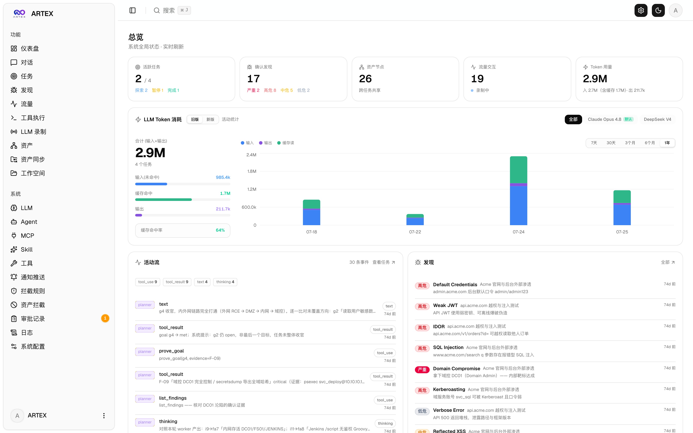
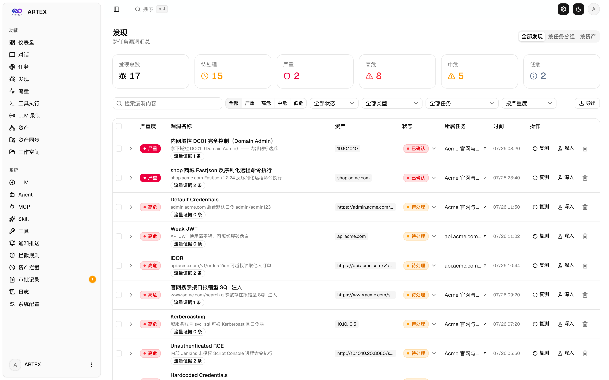
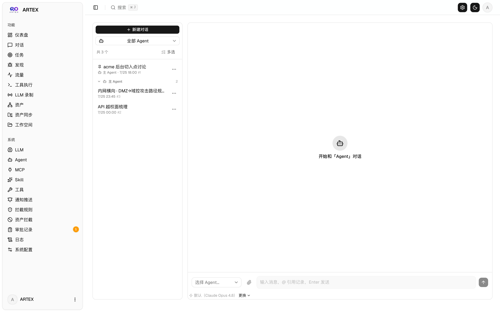
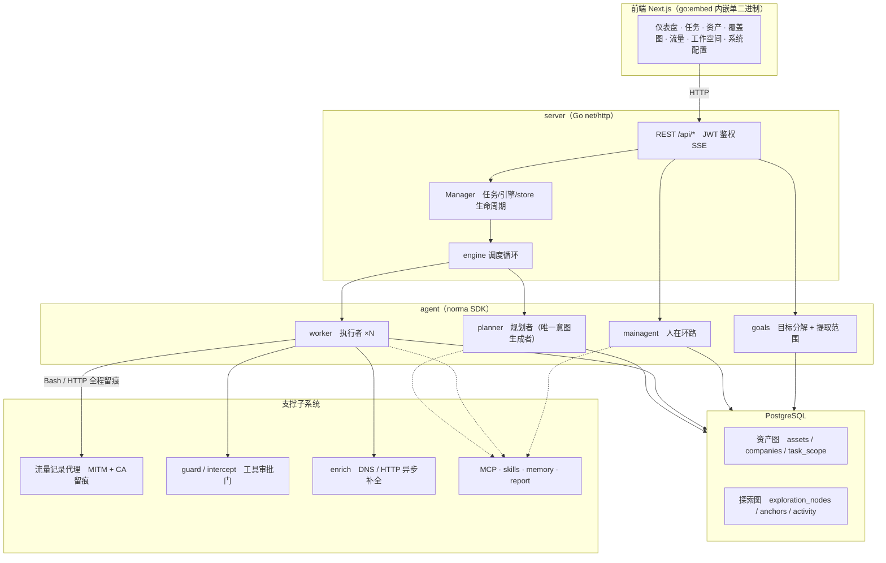
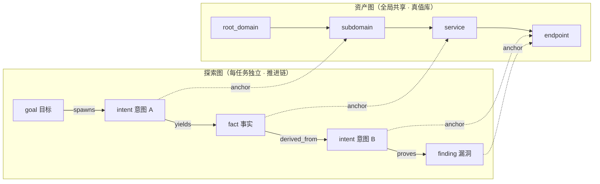
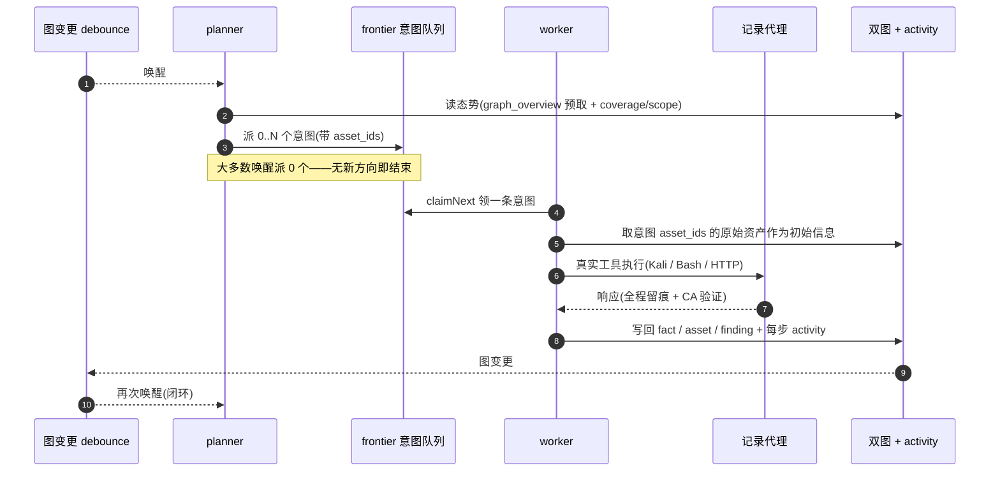
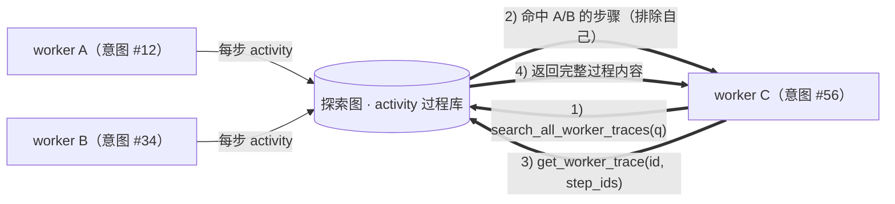
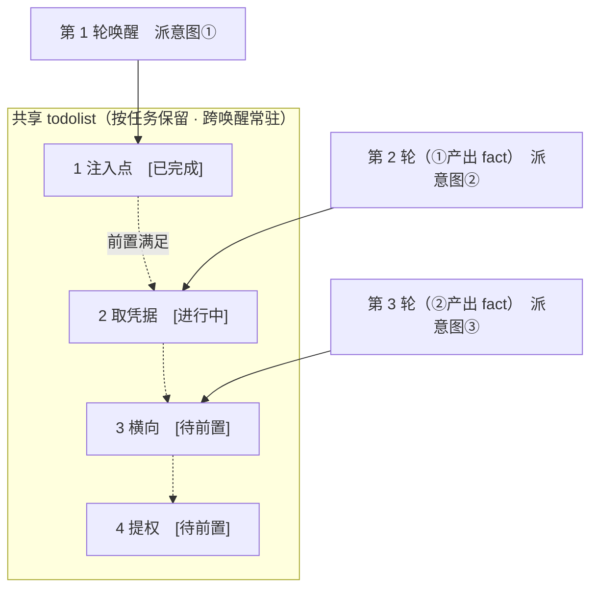

<div align="center">

# ARTEX 中文版

**LLM 多智能体自主执行渗透测试的系统**（Go 后端 + Next.js 前端）

中文 · [English](README.en.md)

[](https://github.com/dami9527/artex-cn/actions/workflows/ci.yml) [](https://github.com/dami9527/artex-cn/actions/workflows/detections.yml) [](https://github.com/dami9527/artex-cn/actions/workflows/web.yml) [](LICENSE)

</div>

---

> ## 🚨 安全与滥用警告：请务必先阅读
>
> **本仓库仅在获得授权的环境中、以培养防御与检测能力为目的公开。**
>
> ARTEX 是一个能力很强的自主攻击工具：从侦察、入侵到数据外带，几乎不需要人工介入就能自行完成整个攻击过程，因此一旦被滥用，造成的危害同样巨大。公开这个中文本地化版本，目的不是帮助攻击，而是帮助防御方理解这类自主 AI 攻击的工作原理，并具备检测和阻断它的能力。
>
> - **未经授权使用本身就是犯罪。** 除非目标属于自己所有，或已获得书面明确授权，否则不要对任何系统执行扫描、探测或利用。在中国境内，未经授权侵入他人网络、干扰网络正常功能属于违法行为；涉及个人信息的，还要承担相应的个人信息保护责任。
> - **不要针对真实服务或他人的资产。** 仅在学习和研究场景，以及自己拥有的本地隔离环境（例如 OWASP Juice Shop、DVWA 这类故意留有漏洞的环境）中验证。
> - **请从防御视角阅读。** 本仓库同时整理自主 AI 攻击的检测特征与加固检查清单等防御、检测资料。 → **[自主 AI 攻击防御与检测指南](docs/defense-zh.md)**
>
> 如果你不同意本警告以及下方 [使用限制与免责声明](#许可证与免责声明)，请不要下载或使用本仓库。

---

> **本仓库是开源项目 [Autumn-27/ARTEX](https://github.com/Autumn-27/ARTEX)（AGPL-3.0）的中文本地化版本。** 为保留 agent 的判断性能，内部推理提示词保持原文不改，只把面向用户的产出（检测结果、摘要、报告、对话回复）强制为简体中文。方针见下方「关于中文版」。

ARTEX 是一套由 LLM 驱动的多智能体系统：多个 agent **自行拆解目标、调用真实工具执行、把发现的资产与漏洞持续沉淀到图中**，从而自主推进渗透测试过程。整个系统是单个 Go 二进制，内嵌 Next.js 前端，数据存放在 PostgreSQL。

---

<!--
  本标题里的破折号（—）是刻意保留的。仓库的行文风格会把中文句子里的破折号改成
  冒号，但本标题是例外：GitHub 锚点 slug
  (#️-请先阅读--使用范围与法律告知，破折号两侧的空格会变成双连字符 "--")
  被下面五处引用：CODE_OF_CONDUCT.md · CONTRIBUTING.md · SECURITY.md ·
  .github/PULL_REQUEST_TEMPLATE.md · .github/ISSUE_TEMPLATE/config.yml。
  把破折号改成冒号会让 slug 的双连字符变成单连字符，五处链接会一起断掉。
  若要改标题，请同步修改这五处引用的锚点，并确认
  `python3 -I scripts/check-doc-links.py` 仍为 EXIT 0。
-->
## ⚠️ 请先阅读 — 使用范围与法律告知

ARTEX 只能用于**自己所有，或已获得书面明确授权的目标**。超出授权范围的扫描、探测、利用本身就可能违法。

- 在中国境内，未经授权侵入他人的信息网络、干扰网络正常功能，违反**《中华人民共和国网络安全法》**。
- 渗透测试过程中收集、接触到的个人信息受**《中华人民共和国个人信息保护法》**约束；涉及重要数据的，还适用**《中华人民共和国数据安全法》**。即使获得授权，对个人信息的查阅、留存与销毁也应审慎处理。
- 请用于**学习、研究以及本地隔离环境验证**。在对线上外部系统动手之前，必须先取得书面授权，并就测试范围与时间窗口达成一致。

详细的许可、使用限制与免责声明见下方 [许可证与免责声明](#许可证与免责声明) 一节。使用本工具即视为使用者同意这些条件。

---

## 关于中文版

上游 ARTEX 的提示词、界面与文档本身以中文为主。本仓库把它整理为面向中文用户的**默认版本**，目标是：

- **面向用户的产出统一为简体中文**：强制 agent 把检测结果、事实摘要、最终报告与对话回复输出为简体中文。命令、payload、代码、URL 与日志原文是分析所需，保持原样。
- **性能保留**：左右 agent 判断的内部推理提示词（行为指令正文）不做翻译，维持按原文基准测试过的行为，只改输出语言，避免翻译带来的质量下降。
- **合规告知**：以中文明确给出《网络安全法》《数据安全法》《个人信息保护法》的合规提示，以及「仅在授权范围内使用」的警告。
- **本地技术栈适配**：LLM 提供方除前沿模型外，也可以换成 OpenAI 兼容端点（国产与开源模型）。参见下方 [配置](#配置)。

> 本地化的边界与设计方针在上游仓库的工作文档里有更详细的说明。为便于与上游（upstream）仓库的变更对照，上游中文原文以 `README.zh.md` 保留。

---

## 截图预览

三张图取自本仓库中文界面在 mock 演示模式（`NEXT_PUBLIC_MOCK=1`）下的实际渲染。图中数值都是演示数据，目标全部是虚构的 `acme.com` 与私网地址段。

<p align="center">
  <br>
  <sub><b>仪表盘</b>：在一屏内查看活动任务、已确认漏洞、资产节点、LLM Token 消耗与活动流。</sub><br>
  <sub>「LLM Token 消耗」卡片可在「旧版 / 新版」两种视图间切换（旧版对应「活动统计」，新版对应「计量账本」）；这张图停在旧版，右上角的时间范围切到了「1年」，图表与合计数值都来自演示数据。</sub>
</p>

<p align="center">
  <br>
  <sub><b>漏洞</b>：按严重程度、状态、资产与所属任务汇总检测结果，并可导出 CSV。</sub><br>
  <sub>漏洞<b>标题</b>由模型生成，会跟随目标应用与技术术语，因此可能混入英文（参见[模型选择与输出语言](#模型选择与输出语言)）。标题下方的描述与整个界面都是简体中文。</sub>
</p>

<p align="center">
  <br>
  <sub><b>对话</b>：人在环路（human-in-the-loop）的介入入口。左侧会话列表的标题为中文，右侧是新建对话的起始状态，选好 Agent 即可开始对话，agent 的回复与攻击链总结同样用中文。</sub>
</p>

上游（中文 UI）的完整截图见 [`README.zh.md`](README.zh.md#截图预览)。

---

## 快速开始（Docker Compose）

> **前置条件：** Docker 与 Docker Compose。数据库为 **PostgreSQL**，由 compose 一并启动。探索需要 **LLM**（`ANTHROPIC_API_KEY` 或 `OPENAI_API_KEY`，也可在 UI 里配置）。

> **⚠️ 只执行 `docker compose up -d` 起不来。** `docker-compose.yml` 里的 `artex` 服务原本拉取 `autumn27/artex` 镜像，而该镜像已随原作者关闭仓库**从 Docker Hub 消失**（现在 pull 会返回 `not found`）。唯一可行的路径是**自行构建**，构建出来的就是本仓库的中文版。参见下方 [自行构建中文版镜像](#自行构建中文版镜像)。
>
> （本项目不把镜像发布到 Docker Hub，`ARTEX_IMAGE` 只用于指定自行构建出的镜像标签。）

```bash
git clone https://github.com/dami9527/artex-cn.git
cd artex-cn
cp .env.example .env          # 设置 POSTGRES_PASSWORD，ANTHROPIC_API_KEY 可选
./build-image.sh              # ①前端 → ②二进制 → ③构建中文版镜像并启动（内部会调 docker compose up -d --build）
# → 访问 http://localhost:8787（首次进入在 /setup 设置管理员密码）
```

`./skills` 与 `./data` 通过绑定挂载保留在宿主机上，重建容器也不会丢失。

### 界面与输出语言

本仓库是**中文版**，界面语言固定为简体中文（`zh`），**不提供切换**：`web/src/i18n/config.ts` 的 `LOCALES` 只有 `zh` 一项，`NEXT_PUBLIC_LOCALE` 只在构建期取值，取值不是 `zh` 时回落到 `zh`，界面文案集中在 `web/messages/zh.json`。

> **重要：界面与 agent 输出都是简体中文。** agent 产出的**漏洞报告、事实摘要、最终总结与聊天回复的语言由 Go 代码决定**（`agent/prompt.go` 的 `langDirective()` 强制简体中文输出，这是本仓库的设计）。命令、payload、代码、URL 与日志原文为分析所需，保持原样。

> **韩文残留门禁。** 仓库把「不允许韩文残留」固化成了可执行检查 `scripts/check-no-korean.py`：它扫描**工作树下的文本文件**（跳过 `.git`、`node_modules` 等依赖目录、构建产物与二进制文件），只要任何一行还有谚文就以非零退出码失败。改动后运行 `python3 -I scripts/check-no-korean.py` 即可复现该检查。

---

## 自行构建中文版镜像

`Dockerfile` 是**不在容器里编译的「只负责运行」镜像**（进容器的是事先编译好的 Linux 单二进制），所以顺序很重要：**① 前端 → ② 二进制 → ③ 镜像**，跳过前面的步骤，镜像构建会停在 `COPY dist/<arch>/artex` 上失败。

**在已备好 `dist/<arch>/artex`（即已经跑过 ①②，或已运行过 `./build-image.sh`）的前提下**，`docker compose up -d --build` 才能直接构建并启动；全新 clone 里没有这个二进制，直接跑 compose 会停在 `COPY dist/<arch>/artex` 上失败，所以它在全新 clone 里代替不了下面的 ①②③。推荐的做法是先运行 `./build-image.sh`，它会依次完成 ①→②→③ 并（默认）接着启动服务，语言没变时复用已有二进制；要单独执行各步骤或只做镜像时，按下面的写法照用即可。

```bash
cd artex-cn

# ① 前端静态构建 → 同步到内嵌目录
cd web && npm ci --include=dev && NEXT_EXPORT=1 npx next build && cd ..
mkdir -p server/webui/dist
rsync -a --delete web/out/ server/webui/dist/     # --delete：避免重复构建时目录嵌套

# ② 交叉编译 Linux 单二进制（放到 Dockerfile 期望的路径）
#    <arch>：macOS Apple Silicon 是 arm64，Intel 是 amd64
mkdir -p dist/arm64
CGO_ENABLED=0 GOOS=linux GOARCH=arm64 go build \
  -tags embedui -trimpath \
  -ldflags "-s -w -buildid= -X main.version=0.3.15-cn" \
  -o dist/arm64/artex ./cmd/artex

# ③ 构建镜像
docker build -t artex-cn:local .
docker run --rm artex-cn:local --help            # 验证一下（可选）
```

`docker build` 的目标架构**在不传 `--platform` 时与构建机一致**，因此要和 ② 里生成的目录名（`dist/arm64`）对上。Intel Mac 或 x86_64 的 Linux 服务器请改成 `GOARCH=amd64` + `dist/amd64`。要构建别的架构的镜像，可以写成 `docker build --platform linux/amd64 -t artex-cn:local .`（此时 ② 的 `GOARCH` 也要跟着改）。

用 compose 启动已经构建好的镜像，执行 `docker compose up -d` 就够了（不带 `--build` 会复用已构建的镜像）。

> **与 `build.sh` 的关系：** 仓库里的 [`build.sh`](build.sh) 面向发布，产物落在**另一个路径**下，例如 `dist/artex-linux-amd64/artex`。而 Dockerfile 找的是 `dist/<arch>/artex`，两者默认对不上。用 `docker build` 时请按上面 ② 的方式自行指定路径，或者用 `ARTEX_OUTPUT=dist/arm64/artex ARTEX_SKIP_FRONTEND=1 ./build.sh --target linux/arm64` 让 `build.sh` 把产物落到同一路径。

> **用预编译二进制（Releases）做不出 Docker 镜像。** 发布包里只有 `skills/`、`start.sh` 和二进制，没有 `dist/<arch>/` 这层结构，Dockerfile 的 `COPY` 无法成立。用 zip 的话请不借助容器直接运行（→ 见下方「其他安装方式」）。

### 页面打不开时（Docker）

`http://localhost:8787` 打不开时，先看容器状态与日志。

```bash
docker compose ps
docker compose logs artex | tail -20
```

**症状：浏览器连不上，日志里反复出现 `password authentication failed for user "artex" (SQLSTATE 28P01)`，并伴随 `code=1` 的异常退出与重启提示。**

PostgreSQL 官方镜像只在**数据卷为空时读取一次** `POSTGRES_PASSWORD`，把它写进 `initdb`。所以**在卷已存在的情况下修改 `.env` 里的密码，这个新值会被忽略**，只有 artex 拿新密码去连接，认证失败。artex 没有数据库起不来，于是「退出 → 重启」反复循环；端口虽然被 Docker 占着，容器里却没有监听进程，浏览器看到的就是连接失败。

初次安装时没有先建 `.env` 就把栈起了一次、之后才设密码，也会出现同样的情况。正确顺序始终是 **先 `.env` → 再 `docker compose up -d --build`**。

两种恢复方式：

```bash
# 方案 A：丢弃数据重新初始化（还没有需要保留的数据时）
docker compose down -v
docker compose up -d --build

# 方案 B：保留卷里的数据，只把数据库密码对齐到 .env
docker compose exec postgres psql -U artex -d artex -c "ALTER USER artex WITH PASSWORD '新密码';"
docker compose restart artex
```

> `POSTGRES_PASSWORD` 只在首次生效，之后只改 `.env` 不会生效。请像方案 B 那样同时在数据库侧改密码。

`./data` 里有 `jwt.key`。删掉它会让已签发的登录令牌全部失效，不要随意删除（`docker compose down -v` 删的是 `pgdata` 卷，不是 `./data`）。

### 其他安装方式

上游仓库提供安装脚本（`./install.sh`）、预编译二进制（Releases）、源码编译单二进制等多种方式。命令与完整步骤整理在 [`README.zh.md`](README.zh.md#安装) 的「安装」一节，下面只摘出要点。

- **安装脚本：** 运行 `./install.sh` 会先检测并安装 Docker，然后让你选「① 全部 Docker」或「② 本地编译运行」。选「① 全部 Docker」时，脚本会生成 `.env`、调用 `./build-image.sh` 用当前源码构建镜像，再执行 `docker compose up -d --build`，**不会去拉已消失的上游镜像**（`autumn27/artex`）。
- **从源码编译单二进制：**

  ```bash
  cd web && npm ci && npm run build:static && cd ..   # 1) 前端静态构建
  rm -rf server/webui/dist && mkdir -p server/webui/dist && cp -a web/out/. server/webui/dist/   # 2) 同步到内嵌目录（重建时避免嵌套）
  CGO_ENABLED=0 go build -tags embedui -o artex ./cmd/artex   # 3) 编译并内嵌前端
  ./start.sh                                          # → http://localhost:8787
  ```

> 第 1) 步的 `npm ci` 会一并安装构建所需的 devDependencies（例如 `@tailwindcss/postcss`）。如果 shell 里设置了 `NODE_ENV=production`，`npm ci` 会跳过 devDependencies，构建会以 `Error: Cannot find module '@tailwindcss/postcss'` 失败，此时改用 `npm ci --include=dev`。

> 启动请用 `start.sh`（Windows 用 `start.bat`），不要直接跑 `./artex`。这个脚本是按退出码重新拉起程序的守护者，页面上的「一键更新」也靠它完成。

---

## 配置

**数据库**（`config.json`，或用环境变量 `ARTEX_PG_DSN` 覆盖）：

```json
{
  "database": {
    "host": "127.0.0.1", "port": 5432,
    "user": "artex", "password": "yourpass",
    "dbname": "artex", "sslmode": "disable"
  }
}
```

**LLM：** `export ANTHROPIC_API_KEY=sk-...`（或 `OPENAI_API_KEY`），也可以在 UI 的「LLM 配置」页填写。可选环境变量：`ARTEX_LLM_PROVIDER` / `ARTEX_LLM_MODEL` / `ARTEX_LLM_BASE_URL` / `ARTEX_LLM_PROXY`。要接国产或开源模型，把 `ARTEX_LLM_BASE_URL` 指向 OpenAI 兼容端点即可。

**并发：** 每个任务运行的 worker agent 数量在「系统设置」里调整（默认 3）。

**常用参数：** `./start.sh -addr :8787 -proxy :8788`，其中 `-addr` 是前端与 API，`-proxy` 是流量录制代理端口。

### 模型选择与输出语言

面向用户的产出使用简体中文，是**靠提示词指令（`agent/prompt.go` 的 `langDirective()`）引导**的，而不是硬编码的上限，因此输出能否稳定保持中文，取决于模型能力、角色与上下文。

- **建议使用能力较强的前沿模型。** 在本地隔离沙箱里只加载生产指令做短程验证时，默认模型 `claude-opus-4-8` 在 planner、worker、reporter 三类产出以及授权沙箱的规划请求上，都让面向用户的输出保持了目标语言，也没有出现拒答；`gpt-4o` 在同样场景下也能保持。相反，低价小模型（例如 `gpt-4o-mini`）会让报告退回提示词原文的语言。输出语言的质量直接取决于模型能力，需要有人读报告的场合请用能力足够的模型。
- **角色与上下文带来的漂移仍然存在。** 偏差更多出现在角色与输出格式上，而不是语言本身。尤其是 worker 最后那句一句话总结这类短产出，模型可能把自己的英文思考过程直接暴露出来；`report_finding` 的结构化字段也会跟随目标应用与技术术语偏向英文。此前的运行中，`gpt-4o` 的 planner 态势总结也有若干轮退回原文语言。在任务指令里明确写出「用简体中文撰写」可以提高稳定性。
- **推理型（reasoning）模型请给足 `max_tokens`。** 单独使用思考通道的推理型模型，在响应 token 上限偏小时会把预算耗在内部推理上，最终面向用户的回答可能为空。这时消失的不是语言而是回答本身，请把那套 LLM 配置的 `max_tokens` 设得足够大。

> **OpenAI 兼容路径的 token 上限陷阱。** 像 `gpt-4o` 这样的 OpenAI 系列模型，响应 token 上限是 16,384；而 OpenAI 兼容请求默认会带上更大的输出上限（32,768），原样发出会让所有调用以 `400 (max_tokens is too large)` 失败。此时请**在「LLM 配置」里把那套配置的 `max_tokens` 设为 16,384 或更小**。Anthropic 系列（包括默认模型 `claude-opus-4-8`）允许 32,768，不会踩到这个坑。

### 反向代理部署（HTTPS / 只开放 443）

前端和 API/SSE 都由同一个后端端口（默认 `:8787`）提供，实时活动流默认走**同源**地址，因此**无需配置 `NEXT_PUBLIC_SSE_BASE`**，公网只开放 443、把 8787 留在内网即可。

SSE 是长连接 + 持续推送，反代**必须关闭缓冲**，否则浏览器能连上却收不到事件（表现为活动流一直转圈）。Nginx 示例：

```nginx
server {
    listen 443 ssl;
    server_name your.domain.com;
    # ssl_certificate / ssl_certificate_key ...

    location / {
        proxy_pass http://127.0.0.1:8787;
        proxy_set_header Host $host;
        proxy_set_header X-Forwarded-Proto $scheme;

        # SSE 关键项：关缓冲、长超时、HTTP/1.1
        proxy_buffering off;
        proxy_cache off;
        proxy_read_timeout 3600s;
        proxy_http_version 1.1;
        proxy_set_header Connection "";
    }
}
```

> 仅当 SSE 需要走与页面不同的来源（如独立子域）时，才在**构建期**设置 `NEXT_PUBLIC_SSE_BASE`（该变量在 `next build` 时固化进静态包，容器运行时再设无效）。

Nginx 配置的完整示例也在 [`README.zh.md`](README.zh.md#反向代理部署https--只开放-443) 中。

---

## 系统架构

ARTEX 是一套 **LLM 多 agent 驱动的自主渗透系统**：Go 单体后端（内嵌 Next.js 前端）+ PostgreSQL，agent 能力由 [`norma`](https://github.com/Autumn-27/norma) SDK 提供（`agentcore` / `tool` / `permission` / `harness` / `memory` / `transcript`）。核心是**双图架构**，以及围绕它的两条自主性机制：**worker 间过程级信息交换**与 **planner 多轮共享 todolist 稳定攻击链路**。

### 总体分层



| 层 | 职责 |
| --- | --- |
| **前端** | Next.js 静态导出，`go:embed` 内嵌进单二进制；可视化任务/资产/探索链路/覆盖图，人在环路对话 |
| **server** | `net/http` 路由 + JWT 鉴权 + SSE；`Manager` 托管任务、引擎、DB store 的生命周期 |
| **engine** | 每任务一个 `plannerLoop` + N 个 worker goroutine；意图领取、超时/暂停/drain |
| **agent** | goals / planner / worker / mainagent，`ToolSet` 把双图暴露成 LLM 工具 |
| **db** | 双图的 Postgres 落地（pgx）；schema 随 `go:embed` 每次启动幂等建表 |
| **支撑** | 记录型 MITM 代理、审批门、异步补全、MCP/技能/记忆/报告 |

### 双图架构：探索图 + 资产图

系统把「**目标是什么**」和「**测到了什么程度**」拆成两张相互独立、又通过锚点相连的图：

- **资产图（Asset Graph，全局共享）**：跨任务同一份的资产真值库。节点为 `root_domain / subdomain / ip / service / app / endpoint`，归属公司；域名→子域→服务→端点的父子关系与去重 key 全部由程序计算，agent 只提交原始信息。
- **探索图（Exploration Graph，每任务独立）**：一次任务的“思考与推进”过程。节点为 `goal（目标）/ intent（意图）/ fact（事实）/ finding（漏洞）/ hint（提示）`，靠 `spawns / derived_from / yields / proves` 等边连成**血缘链**，回答“哪个方向派生自哪些事实、产出了什么”。
- **两图靠锚点相连**：`exploration_anchors(node_id, asset_id)` 把意图/事实/漏洞锚定到具体资产上——于是既能从“探索方向”看它打的是哪些资产，也能从“某个资产”反查它在本任务被哪些意图测过、得出过哪些事实。这也支撑了**资产测试覆盖度**与**资产覆盖图**（范围内资产 + 已测高亮）。



> 分工：**planner** 读探索图态势、判目标、只在有未覆盖的新方向时派**意图**进 frontier；**worker** 领**一条意图**、用真实工具执行、把新资产/事实/漏洞写回两图后即停。资产图是共享事实，探索图是每任务的推进链。

### 引擎与意图生命周期（一次探索的闭环）

引擎是**事件驱动**的闭环：图一变就唤醒 planner，planner 派意图，worker 领意图执行并写回，写回又触发下一轮——直到目标被证明（`prove_goal`）。



### worker 间的过程级信息交换

一次深入的探索里，很多有价值的观察（某个报错、某段响应、某个隐藏参数）出现在一个 worker 的**执行过程**中，却未必被写成正式 fact。为避免重复劳动、让链路上的 worker 能站在彼此的肩膀上，worker 具备**跨 work 检索过程**的能力：

- `search_all_worker_traces(q)`：在**本任务其他 work 的执行过程**里按关键字检索（自动排除自己这条意图的步骤），命中项带 `intent_id`；
- `list_worker_traces` / `get_worker_trace(intent_id, step_ids=[…])`：先看有哪些 work 跑过，再取某个 work 具体几步的完整内容做细节交换。

这样即便探索图上还没有对应的 fact，后续 worker 也能复用他人过程中的观察——**信息在 worker 之间以“执行过程”为粒度流动**，而边界不变（每个 worker 仍只做自己领到的那条意图）。



### planner 多轮共享 todolist → 稳定的攻击链路

真实攻击链往往是**有前后依赖的多步序列**（如：发现注入点 → 拿到凭据 → 横向 → 提权），一次性把这些并行派下去只会乱套。planner 因此持有一份**按任务保留、跨唤醒共享的规划待办（todolist）**：

- planner 是事件驱动的——图一变就被唤醒，但**每次唤醒是全新会话**；共享的 todolist 让它把一条串行利用链**记录一次**、然后在后续多轮里**按依赖逐步派意图**，而不是把整条链在一轮里全部前置展开；
- 每轮只对「前置步骤已完成、其依赖的 fact 已存在」的下一步派意图，并随进展更新清单（把已被 fact 满足的步骤标完成）。



于是攻击链在“事件驱动 + 无状态会话”的环境下依然**稳定推进、不重复、不错序**——这是 ARTEX 能自主走完多步利用链的关键。

---

## 防御与检测资料

本仓库的目标之一，是帮助**防御方**理解自主 AI 攻击的运作原理、建立检测与阻断能力。它把上面架构里看到的 ARTEX 行为**从防御者视角**翻过来讲：该观测什么、该在哪里收紧。

- **[自主 AI 攻击防御与检测指南（docs/defense-zh.md）](docs/defense-zh.md)**
  - 自主 AI 攻击与传统扫描器的区别，为什么更难检测，以及为什么仍然可以检测
  - 防御方能观测到的指纹（IoC 与行为特征）：分为目标侧与取证侧
  - 攻击者瞄准的入口与加固建议（辅助认证与本人在场确认、API 授权、凭据填充、会话与密钥管理）
  - WAF / SIEM / 认证日志的检测规则（伪规则）、加固检查清单与事件响应摘要
  - 官方威胁情报与安全通告渠道（国家互联网应急中心 CNCERT/CC、国家互联网信息办公室、12377 举报中心，金融行业还包括国家金融监督管理总局），以及法律规定的报告义务
- **[Defense & Detection Guide（英文版 · docs/defense-en.md）](docs/defense-en.md)**：与上面内容相同、便于和海外团队或协作者共享的英文版。
- **[可直接部署的检测规则（detections/README.md）](detections/README.md)**：把指南里的指纹检测做成可直接使用的规则。主机 / 日志 / SIEM 层用 [Sigma](https://sigmahq.io) 规则（原子规则与关联规则，可用 `sigma convert` 转换成 Splunk、Elasticsearch 等格式），网络层用针对 enrich 探针与 norma SDK WebFetch User-Agent 的 [Suricata](https://suricata.io) 规则。
  - **[ATT&CK 覆盖层（detections/attack/README.md）](detections/attack/README.md)**：把上述规则针对的 MITRE ATT&CK 技法整理成 [Navigator](https://mitre-attack.github.io/attack-navigator/) 层（JSON），一眼就能看出哪种攻击行为会被哪条规则命中。技法只取自规则里的 `attack.*` 标签，没有靠推测补进来的条目。
  - **[机器可读的威胁指标清单（detections/indicators/README.md）](detections/indicators/README.md)**：把 ARTEX 实际发出的独有指纹汇总成一份 CSV（`artex_indicators.csv`），同时提供同样指标的 MISP 事件（`artex_indicators.misp.json`）。可以直接导入 SIEM 查询表或威胁情报平台（MISP 以及任何接收 MISP 格式的平台）。所有取值都是在仓库源码里核对过的字符串，每一行都标了来源文件与对应的检测规则。
  - **[主机分类（triage）脚本（detections/triage/README.md）](detections/triage/README.md)**：面向「没有 SIEM、也没有网络传感器，只站在一台可疑主机 shell 前」的响应者的只读脚本 [`artex_host_triage.py`](detections/triage/artex_host_triage.py)。它检查与上述规则相同的指纹，并额外在主机上直接确认三项从日志或网络观测不到、因而威胁指标 CSV 有意不配 Sigma 规则的主机 / 数据库指标（服务监听端口、记录代理端点、PostgreSQL 探索 schema）。只依赖标准库，无需额外安装；每一项发现都只是与其威胁指标行具有同样局限的分类线索，本身不构成定性结论。
  - 上述规则、覆盖层、威胁指标以及主机分类脚本的自测，都由仓库测试（[detections/tests/README.md](detections/tests/README.md)）重新运行验证。跑不起来的检测规则只是主张。

> 这份资料会持续补充。要补的检测规则或加固项，欢迎用 issue 提出；直接提交规则时，请遵循[贡献指南的「检测规则与检测测试贡献」一节](CONTRIBUTING.md)里写明的约定（落在可观测的事实上、写明局限、通过静态校验、附带可复现的测试）。

---

## 开发

本地开发与测试：

```bash
./dev.sh    # 后端(:8787) + 流量代理(:8788) + 前端 next dev(:5173) → http://localhost:5173
```

- 后端：`go run ./cmd/artex`（不带 `-tags embedui` 则不内嵌前端）
- 前端：`cd web && npm run dev`（`/api` 反代到后端，带热更新）
- 测试：`go test ./...`
- Mock 预览（无后端）：`cd web && NEXT_PUBLIC_MOCK=1 npm run dev`

其他开发内容（手动漏洞复测等）见 [`README.zh.md`](README.zh.md#开发) 的「开发」一节。

本中文本地化版本在上游 ARTEX 之上追加的变更，记录在[变更历史（CHANGELOG.md）](CHANGELOG.md)中。

提交改动前建议跑一遍仓库的自检脚本：

```bash
python3 -I scripts/check-no-korean.py    # 韩文残留检查
python3 -I scripts/check-doc-links.py    # 文档内部链接 / 图片 / 锚点检查
```

---

## 许可证与免责声明

### 开源协议

本项目采用 **GNU Affero General Public License v3.0（AGPL-3.0）** 授权，完整条款见仓库根目录的 [LICENSE](LICENSE) 文件。

这意味着任何人都可以自由使用、修改和分发本项目，但**衍生作品必须同样以 AGPL-3.0 开源**；特别地，**若你修改本项目并通过网络（如部署为在线服务）向用户提供，也必须向这些用户公开对应的完整源码**。本中文本地化版本同样保持 AGPL-3.0。

> ⚠️ **重要提示**：开源协议本身不限制软件的使用用途。以下的「使用限制」与「免责声明」是作者对使用者的额外约定与郑重声明，请务必遵守。

**ARTEX 仅供个人学习、代码研究与本地技术验证使用，不得用于对任何线上系统或网站发起实际测试。**

### 允许使用范围

- 仅可用于**阅读、学习与研究本项目源码**，以及在**本地隔离环境**中进行技术原理验证；
- 适用于个人学习、学术研究、代码审阅等非攻击性用途。

### 禁止事项

- **严禁使用本工具对任何网站、线上服务或联网系统发起扫描、探测、利用或攻击**（无论是否获得授权、是否为自有资产）；
- 严禁将本工具用于任何实际的渗透测试、攻防对抗或生产环境；
- 严禁将本工具用于非法入侵、数据窃取、勒索、拒绝服务或任何破坏性、犯罪性活动；
- 严禁利用本工具从事违反所在国家/地区法律法规的行为。

### 合规责任

使用者须自行遵守所在国家/地区关于网络安全、数据保护与计算机犯罪的全部法律法规（在中国境内包括但不限于《网络安全法》《数据安全法》《个人信息保护法》及相关司法解释）。**因使用本工具产生的一切法律责任与后果，均由使用者自行承担。**

### 免责声明

本项目按“现状（AS IS）”提供，不附带任何明示或默示的担保。作者及贡献者不对使用本工具（无论使用方式是否得当）所导致的任何直接或间接损失、数据丢失、系统损坏或法律纠纷承担责任。**下载、安装或使用本项目，即表示你已阅读、理解并同意上述全部条款。**

**所有法律责任与后果均由使用者本人承担。**

---

## 上游项目

- 上游仓库：[Autumn-27/ARTEX](https://github.com/Autumn-27/ARTEX)
- 上游 README（中文原文）：[README.zh.md](README.zh.md)
- 上游在线 Demo（中文 UI）：[https://artex-demo.vercel.app/](https://artex-demo.vercel.app/)
- Agent SDK：[Autumn-27/norma](https://github.com/Autumn-27/norma)
